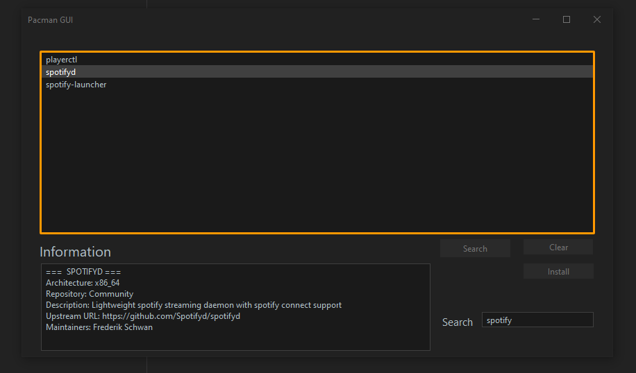
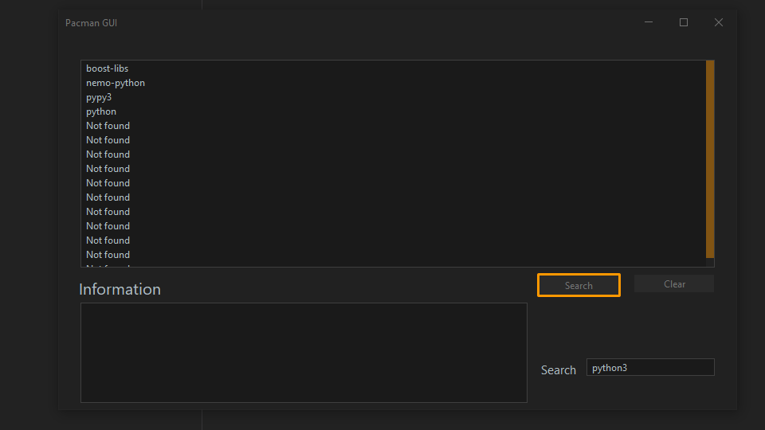

# Pacman GUI
A Simple Gui Application for Pacman 
It gets the pacman package list from the pacman database and displays it in a table. 
It can also install packages (this function was not tested, because im too lazy to try it in a vm) 
It gets / finds the package names and information by using regex... not good regex but it kinda works...
 

 

It was made in [Maven](https://maven.apache.org/) -> [Java17](https://www.oracle.com/java/technologies/downloads/#java17)
 

It uses [JFrame](https://docs.oracle.com/en/java/javase/17/docs/api/java.desktop/javax/swing/JFrame.html) for the GUI and [FlatLaf](https://github.com/TerrificTable/Custom-Minecraft-Launcher#flatlaf) as theming

 
 
(Theme is: `FlatMaterialDarkerContrastTheme`)

 

There are some bugs (one seen in [screenshot 2](images/img_1.png))

# Screenshots
 

